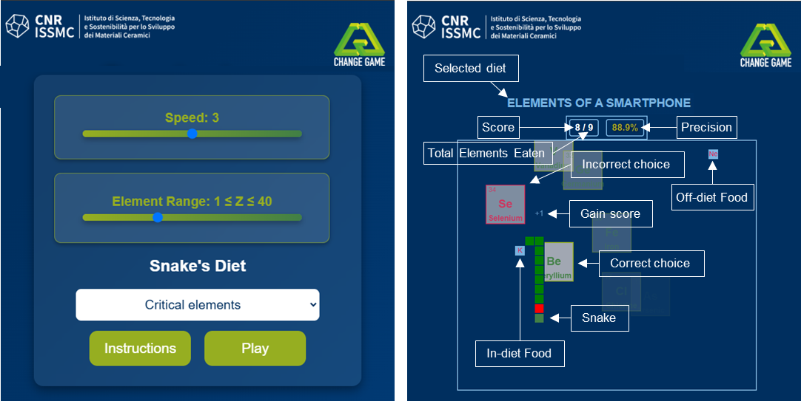

*****
# Snakeleev: Educational Snake Game for Learning the Periodic Table of Chemical Elements
*****

Snakeleev is an engaging open-source educational game designed to help students and educators learn the periodic table of elements through fun and interactive gameplay. Inspired by the classic Snake game, this game reinforces knowledge of chemical elements, their symbols, and properties in a playful and challenging way. It’s perfect for chemistry classes, self-study, and anyone interested in chemistry education through gaming.

Explore the Periodic Table of Chemical Elements through gaming with Snakeleev. Ideal for students and educators looking for an interactive way to reinforce chemistry concepts. Learn the symbols and names of chemical elements in a playful, challenging format.

Key Features:

Engaging gameplay that helps reinforce chemistry concepts.

Open-source and free to use.

Designed for both educators and students.

Author
======
Pietro Galizia ([pietro.galizia@cnr.it](mailto:pietro.galizia@cnr.it))

If you use this code with your students or have any feedback, please feel free to reach out to me. I'd love to hear how it's being used.

Citation
========

Please cite the following reference that demonstrates the educational potential of Snake-based games for learning the periodic table of elements and chemistry concepts:

- Galizia, P. Snakeleev: A Gamified Serious Game for Learning the Periodic Table*. *J. Chem. Educ.*, 2025, 102 (5), 1814–1828. [https://doi.org/10.1021/acs.jchemed.5c00029](https://doi.org/10.1021/acs.jchemed.5c00029)

Also, take a look at *Chemical Elements - Snake* by Verneri Hartus, an engaging and educational chemistry learning game that allows players to practice the names and symbols of chemical elements in 40 different languages. You can find the project here: [Chemical Elements - Snake GitHub](https://github.com/vehave/elements-snake-build/tree/main).

Description
========
Snakeleev is an open-source educational game that combines the classic mechanics of Snake with the science of the periodic table of chemical elemnts. Players control the Snake that grows as it collects elements, with gameplay designed to teach and reinforce knowledge about chemical properties, element groups, and their applications. Perfect for students, educators, and science enthusiasts, Snakeleev transforms learning into an interactive experience while challenging players to think strategically.

License
=========

**Snakeleev** is licensed under the **GNU Affero General Public License v3.0 (AGPL v3.0)**.  

Copyright
=========

    Snakeleev  
    Copyright (C) 2024 Pietro Galizia  

    This program is free software: you can redistribute it and/or modify  
    it under the terms of the GNU Affero General Public License as published by  
    the Free Software Foundation, either version 3 of the License, or  
    (at your option) any later version.  

    This program is distributed in the hope that it will be useful,  
    but WITHOUT ANY WARRANTY; without even the implied warranty of  
    MERCHANTABILITY or FITNESS FOR A PARTICULAR PURPOSE. See the  
    GNU Affero General Public License for more details.  

    You should have received a copy of the GNU Affero General Public License  
    along with this program. If not, see <https://www.gnu.org/licenses/>.

    
For more information, refer to the **full license text** [here](https://www.gnu.org/licenses/agpl-3.0.en.html).  

---

## Contact  

For inquiries, feedback, or collaboration, you can reach me at:  

📧 **Email:** [pietro.galizia@cnr.it](mailto:pietro.galizia@cnr.it)  

📍 **Institutional Address:**  
Institute of Science, Technology and Sustainability for Ceramics (ISSMC; formerly ISTEC)  
National Research Council of Italy (CNR)  
Via Granarolo 64  
48018 Faenza, Italy
